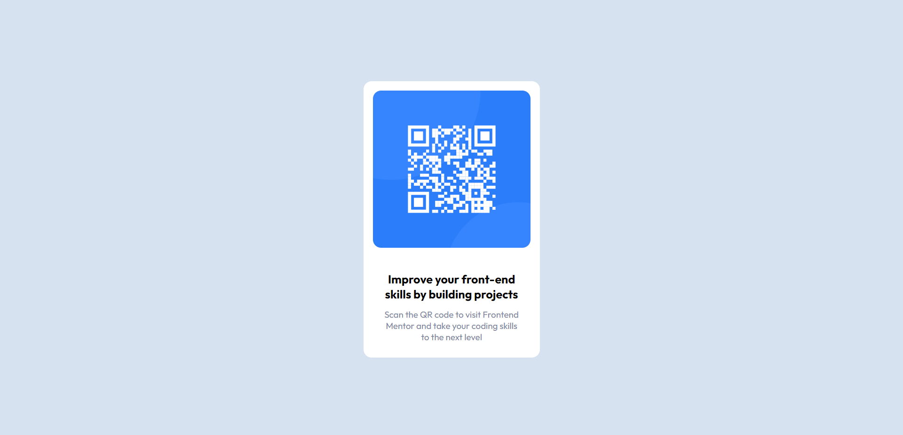

# Frontend Mentor - Solución del componente de código QR

Esta es una solución para el [reto del componente de código QR en Frontend Mentor](https://www.frontendmentor.io/challenges/qr-code-component-iux_sIO_H). Los desafíos de Frontend Mentor te ayudan a mejorar tus habilidades de codificación al construir proyectos realistas.

> [!NOTE]
> **PPR:** Este proyecto es de carácter personal y se ha creado con el propósito de práctica y aprendizaje. La abreviatura "PPR" se refiere a "Proyecto Personal de Práctica".

## Tabla de contenidos

- [Resumen](#resumen)
  - [El desafío](#el-desafío)
  - [Captura de pantalla](#captura-de-pantalla)
  - [Enlaces](#enlaces)
- [Autor](#autor)

## Resumen

### El desafío

El desafío consiste en construir un componente de código QR y hacer que se vea lo más parecido posible al diseño proporcionado.

### Captura de pantalla

### Enlaces

- [URL de la solución](https://mrodriguezdev.github.io/ppr-css-qr-code-component/)

## Autor

- Frontend Mentor - [@mrodriguezdev](https://www.frontendmentor.io/profile/mrodriguezdev)
